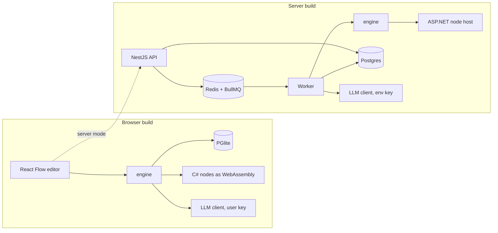

# Relay

Relay is a visual automation engine. You wire nodes on a canvas, run the flow, and inspect
every attempt of every step. The same flow definition runs in two very different places
without being rewritten: entirely inside the browser, or on a server behind a queue and a
pool of workers.

Some nodes are written in C#. In the browser they run as WebAssembly; on the server the same
assembly runs behind an ASP.NET service. One set of golden fixtures runs against both, so
the two runtimes cannot drift apart without a test going red.

Other nodes call a language model. The demo answers from recorded text so that it works with
no key at all, and you can paste your own Anthropic key to see real answers. The key stays in
your tab and never reaches a Relay server.

Live demo (browser mode, no backend): https://arthuralbefaro.github.io/relay/

## Why it is built this way

An automation engine is usually a server product, and a portfolio version of one is usually
a screenshot. Relay keeps the engine free of any environment assumption: it receives its
repository, its queue, and its node executors as dependencies. Swapping those dependencies is
what turns the browser build into the server build.

That constraint is also what makes the demo real. The published page is static, yet it runs
Postgres (through PGlite), executes C#, retries failures, and stores execution history, all
in the visitor's browser.

## Quick start: browser mode

Requirements: Node 22 or newer, pnpm, and the .NET 10 SDK.

```bash
git clone https://github.com/arthuralbefaro/relay.git
cd relay
pnpm install
pnpm dotnet
pnpm dev
```

Open http://localhost:3000 and press "Executar fluxo". The example flow greets you from C#,
uppercases the result in TypeScript, and includes a node that fails twice before succeeding
so you can watch the retry policy work. Everything is stored in the browser and survives a
reload.

The AI nodes in the palette work immediately, answering from recorded text. To get real
answers, paste an Anthropic API key into the left panel. The key is kept in `sessionStorage`,
so it disappears when the tab closes, and requests go straight from your browser to the API.

## Quick start: server mode

Requirements: the above, plus Docker.

```bash
cp .env.example .env
pnpm stack
pnpm stack:migrate
cp apps/web/.env.local.example apps/web/.env.local
pnpm dev
```

`pnpm stack` builds and starts Postgres, Redis, the C# node host, the API, and the worker.
The editor at http://localhost:3000 now reads and writes through the API, and the left panel
says which mode is active. Flows are stored in Postgres, executions are queued in Redis, and
the worker runs them. `pnpm stack:logs` follows the API and worker output; `pnpm stack:down`
stops everything.

AI nodes on the server read `ANTHROPIC_API_KEY` from the worker's environment. Put it in the
root `.env` and restart the stack; without it, those nodes fail with `llm_indisponivel` and
the worker says so at startup.

The API is also usable on its own:

```bash
curl -X POST http://localhost:3001/hooks/principal \
  -H 'content-type: application/json' \
  -d '{"nome":"Arthur"}'
```

## Architecture



The engine never knows where it runs. It receives a `NodeExecutor` per runtime and returns a
full execution log: every step, every attempt, its duration, and its result. The browser
passes it a WebAssembly executor; the worker passes it an HTTP executor pointing at the C#
service.

Full write-up, including the trade-offs of each decision: [docs/architecture.md](docs/architecture.md).
Operational procedures and the failure modes we hit while building it: [docs/runbook.md](docs/runbook.md).

## Repository layout

apps/
web/ Next.js editor, works in both modes
api/ NestJS: flows, webhooks, execution status
worker/ BullMQ consumer that runs flows
packages/
engine/ flow execution: ordering, references, retries, logging
nodes/ node catalog and the TypeScript executor
llm/ LLM clients: Anthropic, recorded answers, balanced JSON extraction
db/ schema, migrations, repository, PGlite and Postgres adapters
dotnet-host/ loads C# nodes over WebAssembly or HTTP
queue/ queue name, job shape, Redis URL parsing
dotnet/
Relay.Nodes/ node implementations, no I/O
Relay.Nodes.Wasm/ browser bridge
Relay.NodeHost/ ASP.NET service
Relay.Nodes.Tests/ xUnit, runs the shared fixtures
fixtures/nodes/ golden cases shared by xUnit and Vitest


## Tests

```bash
pnpm test              # unit tests, plus the C# contract through WebAssembly
pnpm test:dotnet       # xUnit against the same fixtures
pnpm typecheck
pnpm test:integration  # needs pnpm stack: real Postgres and the C# service over HTTP
```

The contract suite is the interesting one. `fixtures/nodes/*.json` holds inputs and expected
outputs. xUnit runs them against the C# library, Vitest runs them against the WebAssembly
build, and the integration suite runs them against the HTTP service. A C# change that alters
the response shape fails in three places at once.

Tests that cannot run fail instead of skipping. A missing WebAssembly build and a passing
suite must not look the same.

No test reaches the network. The LLM clients take `fetch` as an argument, so provider errors,
timeouts, and malformed responses are exercised deterministically.

## Performance

Run the numbers yourself; the table below is filled from your own machine.

```bash
pnpm dotnet && pnpm --filter web pglite
pnpm measure
```

| Asset | Size | Gzipped |
| --- | --- | --- |
| .NET runtime (WebAssembly) | | |
| PGlite | | |

The .NET runtime is only fetched when the open flow contains a C# node, and the editor shows
how long that took. Read it from the left panel after the first run.

| Metric | Value |
| --- | --- |
| First .NET load in the browser | |
| Flow execution, browser mode | |

Server throughput, with the stack running:

```bash
pnpm bench
BENCH_TOTAL=200 BENCH_PARALLEL=20 pnpm bench
```

| Executions | Parallel | Throughput | p50 | p95 |
| --- | --- | --- | --- | --- |
| 50 | 10 | | | |
| 200 | 20 | | | |

## Current limitations

Only manual and webhook triggers exist; there is no scheduler. Flows are single-tenant and
unauthenticated, so the API is meant for local use and not for the public internet. The
browser build allows one tab at a time, because PGlite owns its IndexedDB storage exclusively
and a second tab could corrupt it.

Anthropic is the only LLM provider implemented. Adding another means writing one `LLMClient`,
since no node depends on the provider. Browser requests carry the key from the tab to the API,
which is fine for a demo you run with your own key and wrong for a product with real users.

## Contributing

`pnpm typecheck` and `pnpm test` must pass before a pull request. Change one thing at a time:
when a node's behaviour changes, the fixture changes with it, and both runtimes are expected
to agree.

## License

MIT. See [LICENSE](LICENSE).